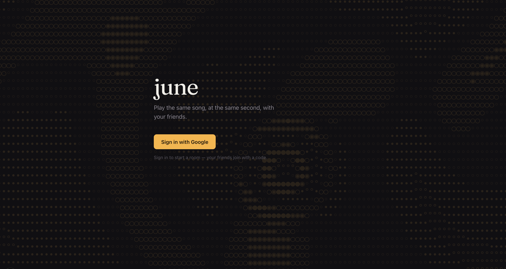
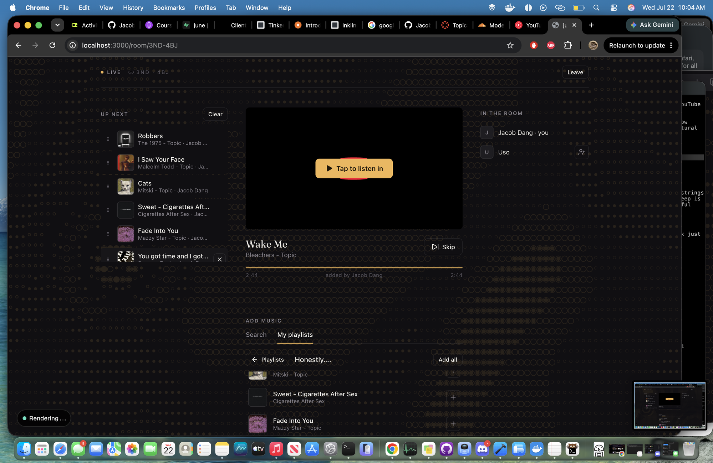

# june

A jam room for YouTube Music — friends join a room by code and listen to the
same queue, **in sync**, each in their own browser.





## How it works

june never touches the audio. Each participant's browser plays the video through
YouTube's own **IFrame player**; the server only coordinates *what* is playing
and *when it started*. Everyone computes their position as `serverNow − startedAt`
and converges — no audio ever flows through june.

```
Discovery (0 YouTube quota)   iTunes Search API  →  resolve to a videoId once  →  cached forever
Add music                      paste link (1 unit) · search · import playlist (cheap)
Room state                     Supabase Postgres + Realtime (rooms, queue_items, room_participants)
Playback                       each browser's YouTube IFrame player, seeked to the shared clock
```

## Features

- **Synced playback** — same song, same second, in every browser in the room.
- **Rooms + invite links** — start a jam, share the room link; signed-out invitees
  sign in and auto-join.
- **Forgiving search + artist view** — typo/noise-tolerant song search (iTunes,
  zero YouTube quota) that ranks the studio version first, plus a click-through
  artist view of top songs.
- **Queue** — a scrollable "up next" window with **drag-to-reorder** (touch-friendly).
- **Playlist import** — browse your YouTube playlists in a stacked card deck and
  add tracks or whole playlists.
- **Friends** — search by name/username, requests with an in-room toast
  notification, see which friends are **in a jam**, and jump into their room.
- **Profiles** — display name, `@username`, and avatar upload (HEIC → square WebP).
- **Owner metrics** — an owner-only dashboard for YouTube quota + app stats.
- **Signup cap** — a configurable seat limit while the app is new.

## Stack

- **Next.js 16** (App Router, Server Actions, middleware) + **React 19** + **TypeScript**
- **Supabase** — Postgres, Auth (Google OAuth), Row-Level Security, `SECURITY DEFINER`
  RPCs, Realtime, Storage (avatars), `pg_cron` (dead-room sweep)
- **motion** (framer-motion) — springy interactions, drag-reorder, transitions
- **YouTube Data API** (playback/resolution) + **iTunes Search API** (zero-quota discovery)
- **sharp** — avatar image pipeline
- **Vitest** — unit tests for the pure logic
- **Vercel** — hosting

## Architecture

- **`src/jam/`** — the pure, tested core: FIFO queue, sync clock, NTP-style
  clock-offset estimation. No IO, deterministic (`now` is a parameter).
- **`src/youtube/`** — YouTube Data API layer: parsing, fetch-injected client,
  playlist import. Anti-corruption boundary with Zod validation.
- **`src/discovery/`** — iTunes Search API client + pure query normalization,
  result ranking, and artist matching.
- **`src/lib/`** — Supabase auth, the video-metadata cache, friends, profiles,
  metrics, and the room (schema types, server actions, add-music).
- **`app/`** — Next.js App Router UI (auth, lobby, room, synced player).
- **`supabase/migrations/`** — schema, RLS policies, and participant-checked
  `SECURITY DEFINER` functions (room lifecycle, queue reorder, signup cap, etc.).

## Local development

```bash
npm install
cp .env.local.example .env.local   # fill in the values
npm run dev                        # http://localhost:3000
```

`.env.local` (see `.env.local.example`):

| Variable | Purpose |
| --- | --- |
| `NEXT_PUBLIC_SUPABASE_URL`, `NEXT_PUBLIC_SUPABASE_ANON_KEY` | Supabase client (public) |
| `SUPABASE_SERVICE_ROLE_KEY` | Server-side writes that bypass RLS (secret) |
| `YOUTUBE_API_KEY` | YouTube Data API |
| `GOOGLE_CLIENT_ID`, `GOOGLE_CLIENT_SECRET` | Refresh the YouTube token (same OAuth client as the Supabase Google provider) |
| `ADMIN_EMAIL` | Owner email for the `/metrics` dashboard |
| `SIGNUP_CAP` | Optional seat cap (defaults to 20) |

Google sign-in also requires the Supabase Google provider + a Google OAuth client
(redirect URI = your Supabase `/auth/v1/callback`).

## Testing

```bash
npm test          # unit tests for the pure logic (jam core, youtube, cache, discovery, friends, ...)
npm run typecheck
npm run build
```

The realtime sync and IFrame playback are integration behavior — verify them by
opening a room in **two browsers** and confirming they play the same track at the
same position.

## Deploy (Vercel)

1. Push to GitHub, import the repo in Vercel.
2. Set the env vars above in Vercel project settings.
3. In Supabase → Authentication → URL Configuration: set the Site URL and add a
   `https://<your-domain>/**` redirect URL.
4. Publish the Google OAuth consent screen to **Production** so YouTube refresh
   tokens don't expire after 7 days (the `youtube.readonly` scope is sensitive, so
   users see an "unverified app" screen until you complete verification).

Runs on free tiers (Vercel Hobby + Supabase Free).
