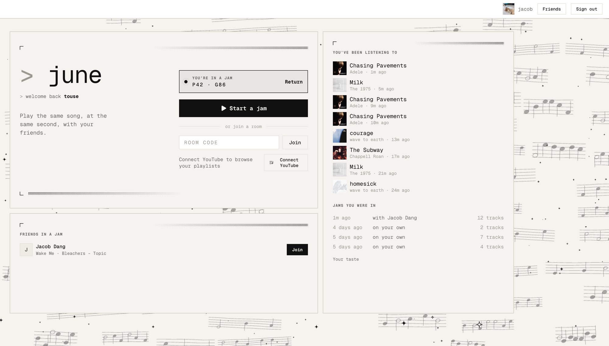
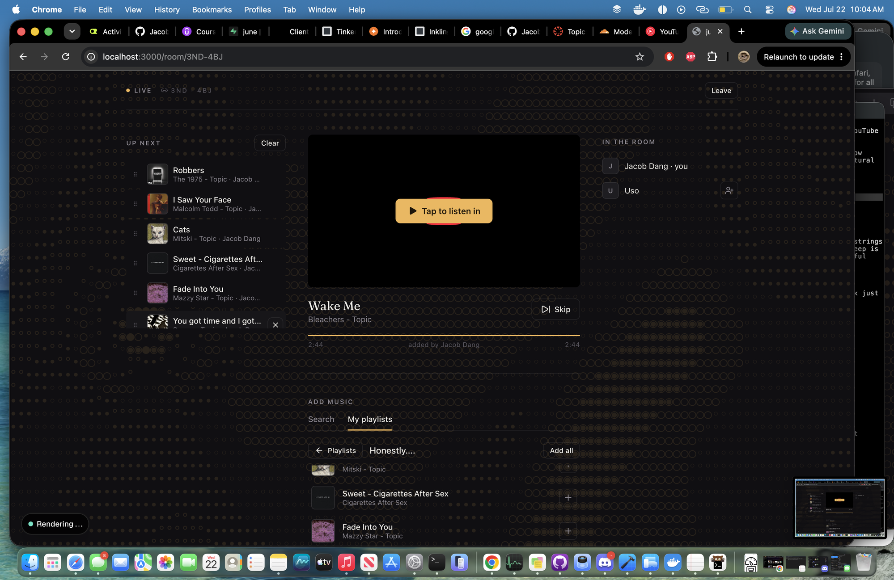

# june

A jam room for music — friends join by code and listen to the same queue,
**in sync**, each in their own browser.





## How it works

A small self-hosted audio server (`mp3server`, a sibling repo) fetches each track
once and streams it back over signed, expiring URLs. Each browser plays that
stream in a plain `<audio>` element; june's database only coordinates *what* is
playing and *when it started*. Everyone computes their position as
`serverNow − startedAt` and converges.

```
Discovery      iTunes Search API  →  resolve to a videoId once  →  cached forever
Audio          mp3server fetches the track, stores it, streams it back (HTTP Range)
Room state     Supabase Postgres + Realtime (rooms, queue_items, participants, chat)
Playback       each browser's <audio>, seeked to the shared clock
```

Playing real audio rather than an embedded player is what makes it work on a
phone with the screen off, and on networks that block YouTube.

## Features

- **Synced playback** — same song, same second, in every browser in the room.
- **Per-device sound** — mute or set the volume on *this* screen, so a laptop and
  a phone can both be in the jam without doubling up.
- **Chat** — realtime, in the room, alongside the queue.
- **Lyrics (beta)** — line by line, timed from the video's own captions where they
  exist and a lyrics database otherwise.
- **Search that keeps up** — results as you type (iTunes, zero YouTube quota),
  ranked so the studio version wins, with a click-through artist view.
- **Queue** — a scrollable "up next" with drag-to-reorder, and suggestions drawn
  from what the room has played once it runs dry.
- **Playlists** — browse your own YouTube playlists, or paste any playlist link
  and pick tracks from it.
- **Friends** — requests with an in-room toast, and see what a friend is playing
  right now with a button to join them.
- **Your listening** — recently played and past jams on the home page, top artists
  on your profile. Visible to you and to whoever was in the room with you.
- **Profiles** — display name, `@username`, bio, avatar.

## Stack

- **Next.js 16** (App Router, Server Actions) + **React 19** + **TypeScript**
- **Supabase** — Postgres, Auth (Google), RLS, `SECURITY DEFINER` RPCs, Realtime,
  Storage, `pg_cron`
- **mp3server** — FastAPI + arq + yt-dlp on a small VM, behind Caddy for TLS
- **iTunes Search API** for discovery, **YouTube Data API** for resolution and playlists
- **Vitest** — unit tests for the pure logic
- **Vercel** — hosting

## Layout

- **`src/jam/`** — the pure core: queue, sync clock, clock-offset estimation.
  No IO, deterministic (`now` is a parameter).
- **`src/audio/`** — mp3server client, download progress, visualizer spectrum math.
- **`src/lyrics/`** — LRC parsing, caption conversion, lyrics matching.
- **`src/discovery/`** · **`src/youtube/`** — iTunes search and ranking; the
  YouTube API layer, with Zod validation at the boundary.
- **`src/lib/`** — Supabase clients, room actions, plays, friends, profiles.
- **`app/`** — App Router UI (lobby, room, player, chat, profile).
- **`supabase/migrations/`** — schema, RLS, and participant-checked RPCs.

How the pieces fit together, the invariants that aren't obvious from the code,
and the operations runbook are in
**[docs/ARCHITECTURE.md](docs/ARCHITECTURE.md)**.

## Local development

```bash
npm install
cp .env.local.example .env.local   # fill in the values
npm run dev                        # http://localhost:3000
```

| Variable | Purpose |
| --- | --- |
| `NEXT_PUBLIC_SUPABASE_URL`, `NEXT_PUBLIC_SUPABASE_ANON_KEY` | Supabase client (public) |
| `SUPABASE_SERVICE_ROLE_KEY` | Server-side writes that bypass RLS (secret) |
| `NEXT_PUBLIC_MP3SERVER_URL` | The audio server |
| `YOUTUBE_API_KEY` | YouTube Data API |
| `GOOGLE_CLIENT_ID`, `GOOGLE_CLIENT_SECRET` | Refresh the YouTube token |
| `ADMIN_EMAIL` | Owner email for `/metrics` |
| `SIGNUP_CAP` | Optional seat cap (defaults to 20) |

Sign-in needs the Supabase Google provider plus a Google OAuth client whose
redirect URI is your Supabase `/auth/v1/callback`. Running the audio server
locally is covered in the architecture doc.

## Testing

```bash
npm test          # the pure logic: sync clock, queue, lyrics, discovery, plays…
npm run typecheck
npm run build
```

Sync, realtime and playback are integration behaviour — verify them by opening a
room in **two browsers** and confirming both play the same track at the same
position.

## Deploy

Vercel for the app, any small VM for the audio server (the architecture doc has
the runbook). Set the env vars above in Vercel, add `https://<your-domain>/**`
as a Supabase redirect URL, and publish the Google OAuth consent screen so
YouTube refresh tokens don't expire after 7 days.

The app runs on free tiers; the audio server needs a machine with disk.
